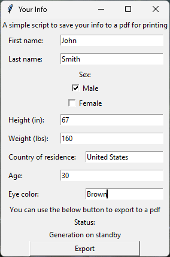

# Your_info

Your_info is a simple python script that allows you to enter your information into a window and save it to a pdf for printing

This open source project aims to make printing your information easier and more accessible.

## Example Images

Image with example values in the generator

Image of generated pdf

## Running the project 
### To run the script either:
**Download the latest release for windows from the releases page on github**

[Releases](https://github.com/Cole-Weems/Your_info/releases/tag/Demo)

### Or
**Clone into the project and run the main.py file:**

Use `git clone https://github.com/Cole-Weems/Your_info` to clone the repo

Also make sure to install reportlab with `pip install reportlab`

Lastly, run `python main.py`

### Errors:

If tkinter is not installed, please refer to this guide:

[Tkinter guide](https://tkdocs.com/tutorial/install.html)

## How to use the generator

Fill in all of the fields with your information, then click export to choose a save location for your pdf

### AI usage
AI (ChatGPT) was used only for the purpose of debugging and solving bugs.
